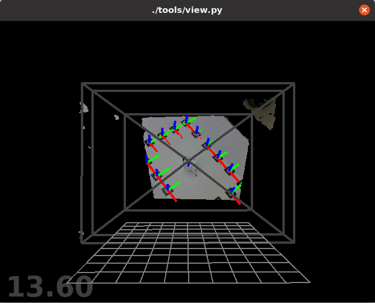
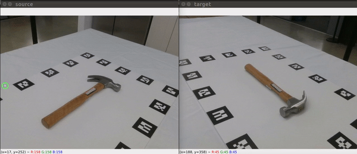

# Toolkit for the [FewSOL dataset](https://arxiv.org/abs/2207.03333)

To use the toolkit, first download the FewSOL dataset from [here](https://irvlutd.github.io/FewSOL/).
Download all the zip files, and unzip them into a FewSOL folder.
Create a symbol link of the dataset in the root folder of this repo.
```
cd $ROOT
ln -s $FewSOL_DATA FewSOL
```

The dataset should have the following structure.
```angular2html
├── ...
├── FewSOL
|   |── google_scan_selected    # 3D models from the Google Scanned Objects
|   |   |── 11pro_SL_TRX_FG
|   |   |── 2_of_Jenga_Classic_Game
|   |   └── ...
|   |── google scenes 		# 40,000 sythetic scenes
|   |   |── palette.txt
|   |   |── train
|   |   └── ...
|   |── OCID_objects 		# 2,300 objects from the OCID dataset
|   |   |── ARID10_floor_bottom_box_seq03_obj01
|   |   |── ARID10_floor_bottom_box_seq03_obj02
|   |   └── ...
|   |── real_objects 		# 336 real objects with 9 RGB-D images per object
|   |   |── 0320T173759
|   |   |── 0320T174037
|   |   └── ...
|   |── synthetic_objects       # 330 synthetic objects with 9 RGB-D images per object
|   |   |── 11pro_SL_TRX_FG
|   |   |── 2_of_Jenga_Classic_Game
|   |   └── ...
└── ...
```

## Installation

1. create and activate a conda environment
```
conda create --name fewsol
conda activate fewsol
```

2. install python packages
```Shell
pip install -r requirements.txt
```

3. Use conda to install [pytorch](https://pytorch.org/). For example,
```
conda install pytorch torchvision torchaudio cudatoolkit=11.6 -c pytorch -c conda-forge
```

4. compile the utility functions with:
```
./build.sh
```

5. (optional) install the [ar_track_alvar](http://wiki.ros.org/ar_track_alvar) ros package


## Regarding Object Poses in the Real Object Data
The object pose is computed using RANSAC with the AR tags poses.
We assume the object is in the center of the marker board, and compute the center of the marker board as the object pose.
The function to compute the object pose is the compute_marker_board_center() function in tools/image_loader.py.
Please check this function if you want to use the object poses in our dataset.


## Visualization of data

- View real images
```
# $GPU_ID can be 0, 1; $FOLDER_PATH can be FewSOL/real_objects/0320T182600
./scripts/view_images.sh $GPU_ID $FOLDER_PATH
./scripts/view_images.sh 0 FewSOL/real_objects/0320T182600
```


- View synthetic images
```
# $GPU_ID can be 0, 1; $FOLDER_PATH can be FewSOL/google_scenes/train/scene_00000
./scripts/view_images_syn.sh $GPU_ID $FOLDER_PATH
./scripts/view_images_syn.sh 0 FewSOL/google_scenes/train/scene_00000
```

- View correspondences of real images
```
# $GPU_ID can be 0, 1; $FOLDER_PATH can be FewSOL/real_objects/0320T182600
./scripts/view_corr.sh $GPU_ID $FOLDER_PATH
./scripts/view_corr.sh 0 FewSOL/real_objects/0320T182600
```


## AR tag tracking using ROS

- start realsense
```
roslaunch realsense2_camera rs_aligned_depth.launch tf_prefix:=measured/camera
```

- start rviz
```
rosrun rviz rviz -d ./ros/artag.rviz
```

- start AR tag tracking
```
roslaunch ar_track_alvar realsense_indiv.launch
roslaunch easy_handeye publish_eye_on_hand.launch
```

## Citation

If you find the FewSOL dataset useful in your research, please consider citing:
```bibtex
@INPROCEEDINGS{padalunkal2023fewsol,
  title={FewSOL: A Dataset for Few-Shot Object Learning in Robotic Environments}, 
  author={P, Jishnu Jaykumar and Chao, Yu-Wei and Xiang, Yu},
  booktitle={2023 IEEE International Conference on Robotics and Automation (ICRA)}, 
  doi={10.1109/ICRA48891.2023.10161143},
  pages={9140-9146},
  year={2023}
}
```
